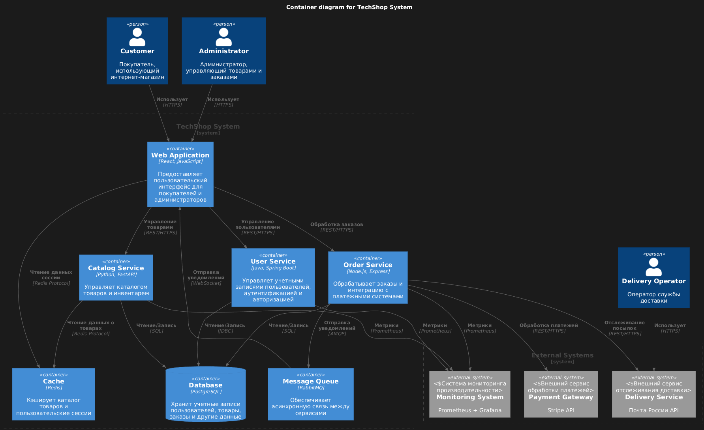

# Бизнес-система: Интернет-магазин электроники "TechShop"

## Описание системы:
TechShop - это онлайн-платформа для продажи электронных товаров, включая смартфоны, ноутбуки, планшеты и аксессуары. Система предоставляет пользователям возможность просматривать каталог товаров, добавлять их в корзину, оформлять заказы и отслеживать статус доставки. Для администраторов доступны функции управления каталогом, обработки заказов и аналитики продаж.

### Основные сервисы:
 - Web Application - клиентская часть приложения, реализованная на React.js
 - User Service - сервис управления пользователями на Java/Spring Boot
 - Catalog Service - сервис управления каталогом товаров на Python/FastAPI
 - Order Service - сервис обработки заказов на Node.js/Express

### Внешние зависимости:
 - База данных PostgreSQL - хранение всех бизнес-данных
 - Redis - кэширование и сессии
 - RabbitMQ - очередь сообщений для асинхронной обработки
 - Stripe API - внешний сервис обработки платежей
 - Почта России API - внешний сервис доставки

### Компоненты вне K8S:
 - PostgreSQL - 4 ядра CPU, 16 ГБ RAM, 500 ГБ SSD
 - Redis - 2 ядра CPU, 8 ГБ RAM, 100 ГБ SSD
 - RabbitMQ - 2 ядра CPU, 4 ГБ RAM, 200 ГБ SSD
 - Мониторинг - 2 ядра CPU, 8 ГБ RAM, 300 ГБ SSD

### Kubernetes компоненты
**Система использует следующие компоненты Kubernetes:**

 - Deployment - для развертывания всех сервисов
 - Service - для внутренней сетевой связи между сервисами
 - Ingress - для внешнего доступа к веб-интерфейсу и API
 - ConfigMap - для хранения конфигурационных параметров
 - Secret - для хранения чувствительных данных
 - CronJob - для регулярного резервного копирования

### Безопасность
**Для обеспечения безопасности реализованы следующие меры:**

 - Network Policies для ограничения сетевого взаимодействия между сервисами
 - Использование Secrets для хранения конфиденциальных данных
 - Ограничение ресурсов контейнеров (requests/limits)
 - Внешние зависимости подключаются по защищенным протоколам

### Мониторинг и масштабирование
Система спроектирована с учетом возможности горизонтального масштабирования. Каждый сервис может быть независимо масштабирован в зависимости от нагрузки. Для мониторинга используется Prometheus и Grafana.

### Схема компонентов


### Текст yaml
```yaml
---
---
# ConfigMap для конфигурации сервисов
apiVersion: v1
kind: ConfigMap
metadata:
  name: techshop-config
data:
  DB_HOST: "db.techshop.internal"
  DB_PORT: "5432"
  REDIS_HOST: "cache.techshop.internal"
  REDIS_PORT: "6379"
  MQ_HOST: "mq.techshop.internal"
  STRIPE_API_URL: "https://api.stripe.com"
  DELIVERY_API_URL: "https://api.pochta.ru"

---
# ConfigMap для внешних сервисов
apiVersion: v1
kind: ConfigMap
metadata:
  name: external-services-config
data:
  # Конфигурация PostgreSQL
  POSTGRES_HOST: "192.168.10.10"
  POSTGRES_PORT: "5432"
  POSTGRES_DB: "techshop_db"
  
  # Конфигурация Redis
  REDIS_EXTERNAL_HOST: "192.168.10.20"
  REDIS_EXTERNAL_PORT: "6379"
  
  # Конфигурация RabbitMQ
  RABBITMQ_HOST: "192.168.10.30"
  RABBITMQ_PORT: "5672"
  RABBITMQ_MANAGEMENT_PORT: "15672"
  
  # Конфигурация мониторинга
  PROMETHEUS_HOST: "192.168.10.40"
  PROMETHEUS_PORT: "9090"
  GRAFANA_HOST: "192.168.10.40"
  GRAFANA_PORT: "3000"

---
# Secret для чувствительных данных
apiVersion: v1
kind: Secret
metadata:
  name: techshop-secrets
type: Opaque
data:
  DB_PASSWORD: "cGFzc3dvcmQ="  # base64 encoded "password"
  JWT_SECRET: "and0LXNlY3JldA=="  # base64 encoded "jwt-secret"
  STRIPE_API_KEY: "c2tfdGVzdF8xMjM0NTY3ODkw"  # base64 encoded "sk_test_1234567890"
  REDIS_PASSWORD: "cmVkaXMtcGFzcw=="  # base64 encoded "redis-pass"
  RABBITMQ_USER: "cmFiYml0"  # base64 encoded "rabbit"
  RABBITMQ_PASSWORD: "cmFiYml0LXBhc3M="  # base64 encoded "rabbit-pass"

---
# Secret для внешних сервисов
apiVersion: v1
kind: Secret
metadata:
  name: external-services-secrets
type: Opaque
data:
  POSTGRES_USER: "dGVjaHNob3A="  # base64 encoded "techshop"
  POSTGRES_PASSWORD: "dGVjaHNob3AtcGFzcw=="  # base64 encoded "techshop-pass"
  DELIVERY_API_KEY: "ZGVsaXZlcnkta2V5"  # base64 encoded "delivery-key"

---
# Deployment для Web Application
apiVersion: apps/v1
kind: Deployment
metadata:
  name: techshop-frontend
spec:
  replicas: 3
  selector:
    matchLabels:
      app: techshop-frontend
  template:
    metadata:
      labels:
        app: techshop-frontend
    spec:
      containers:
      - name: frontend
        image: techshop/frontend:latest
        ports:
        - containerPort: 80
        env:
        - name: API_BASE_URL
          value: "http://api.techshop.local"
        - name: NODE_ENV
          value: "production"
        resources:
          requests:
            cpu: "100m"
            memory: "128Mi"
          limits:
            cpu: "500m"
            memory: "512Mi"

---
# Deployment для User Service
apiVersion: apps/v1
kind: Deployment
metadata:
  name: techshop-user-service
spec:
  replicas: 2
  selector:
    matchLabels:
      app: techshop-user-service
  template:
    metadata:
      labels:
        app: techshop-user-service
    spec:
      containers:
      - name: user-service
        image: techshop/user-service:latest
        ports:
        - containerPort: 8080
        env:
        - name: DB_HOST
          valueFrom:
            configMapKeyRef:
              name: techshop-config
              key: DB_HOST
        - name: DB_PORT
          valueFrom:
            configMapKeyRef:
              name: techshop-config
              key: DB_PORT
        - name: DB_PASSWORD
          valueFrom:
            secretKeyRef:
              name: techshop-secrets
              key: DB_PASSWORD
        - name: JWT_SECRET
          valueFrom:
            secretKeyRef:
              name: techshop-secrets
              key: JWT_SECRET
        resources:
          requests:
            cpu: "200m"
            memory: "256Mi"
          limits:
            cpu: "1"
            memory: "1Gi"

---
# Deployment для Catalog Service
apiVersion: apps/v1
kind: Deployment
metadata:
  name: techshop-catalog-service
spec:
  replicas: 2
  selector:
    matchLabels:
      app: techshop-catalog-service
  template:
    metadata:
      labels:
        app: techshop-catalog-service
    spec:
      containers:
      - name: catalog-service
        image: techshop/catalog-service:latest
        ports:
        - containerPort: 8080
        env:
        - name: DB_HOST
          valueFrom:
            configMapKeyRef:
              name: techshop-config
              key: DB_HOST
        - name: DB_PORT
          valueFrom:
            configMapKeyRef:
              name: techshop-config
              key: DB_PORT
        - name: REDIS_HOST
          valueFrom:
            configMapKeyRef:
              name: techshop-config
              key: REDIS_HOST
        - name: REDIS_PORT
          valueFrom:
            configMapKeyRef:
              name: techshop-config
              key: REDIS_PORT
        resources:
          requests:
            cpu: "200m"
            memory: "256Mi"
          limits:
            cpu: "1"
            memory: "1Gi"

---
# Deployment для Order Service
apiVersion: apps/v1
kind: Deployment
metadata:
  name: techshop-order-service
spec:
  replicas: 2
  selector:
    matchLabels:
      app: techshop-order-service
  template:
    metadata:
      labels:
        app: techshop-order-service
    spec:
      containers:
      - name: order-service
        image: techshop/order-service:latest
        ports:
        - containerPort: 8080
        env:
        - name: DB_HOST
          valueFrom:
            configMapKeyRef:
              name: techshop-config
              key: DB_HOST
        - name: DB_PORT
          valueFrom:
            configMapKeyRef:
              name: techshop-config
              key: DB_PORT
        - name: MQ_HOST
          valueFrom:
            configMapKeyRef:
              name: techshop-config
              key: MQ_HOST
        - name: STRIPE_API_KEY
          valueFrom:
            secretKeyRef:
              name: techshop-secrets
              key: STRIPE_API_KEY
        - name: STRIPE_API_URL
          valueFrom:
            configMapKeyRef:
              name: techshop-config
              key: STRIPE_API_URL
        - name: DELIVERY_API_URL
          valueFrom:
            configMapKeyRef:
              name: techshop-config
              key: DELIVERY_API_URL
        resources:
          requests:
            cpu: "200m"
            memory: "256Mi"
          limits:
            cpu: "1"
            memory: "1Gi"

---
# Service для Web Application
apiVersion: v1
kind: Service
metadata:
  name: frontend-service
spec:
  selector:
    app: techshop-frontend
  ports:
    - protocol: TCP
      port: 80
      targetPort: 80
  type: ClusterIP

---
# Service для User Service
apiVersion: v1
kind: Service
metadata:
  name: user-service
spec:
  selector:
    app: techshop-user-service
  ports:
    - protocol: TCP
      port: 80
      targetPort: 8080
  type: ClusterIP

---
# Service для Catalog Service
apiVersion: v1
kind: Service
metadata:
  name: catalog-service
spec:
  selector:
    app: techshop-catalog-service
  ports:
    - protocol: TCP
      port: 80
      targetPort: 8080
  type: ClusterIP

---
# Service для Order Service
apiVersion: v1
kind: Service
metadata:
  name: order-service
spec:
  selector:
    app: techshop-order-service
  ports:
    - protocol: TCP
      port: 80
      targetPort: 8080
  type: ClusterIP

---
# Ingress
apiVersion: networking.k8s.io/v1
kind: Ingress
metadata:
  name: techshop-ingress
  annotations:
    nginx.ingress.kubernetes.io/rewrite-target: /
spec:
  rules:
  - host: techshop.local
    http:
      paths:
      - path: /
        pathType: Prefix
        backend:
          service:
            name: frontend-service
            port:
              number: 80
  - host: api.techshop.local
    http:
      paths:
      - path: /user
        pathType: Prefix
        backend:
          service:
            name: user-service
            port:
              number: 80
      - path: /catalog
        pathType: Prefix
        backend:
          service:
            name: catalog-service
            port:
              number: 80
      - path: /order
        pathType: Prefix
        backend:
          service:
            name: order-service
            port:
              number: 80

---
# CronJob для резервного копирования
apiVersion: batch/v1
kind: CronJob
metadata:
  name: backup-job
spec:
  schedule: "0 2 * * *"
  jobTemplate:
    spec:
      template:
        spec:
          containers:
          - name: backup
            image: postgres:13
            command:
            - /bin/bash
            - -c
            - "pg_dump -h $DB_HOST -U $DB_USER $DB_NAME > /backup/backup-$(date +%Y%m%d).sql"
            env:
            - name: DB_HOST
              valueFrom:
                configMapKeyRef:
                  name: techshop-config
                  key: DB_HOST
            - name: DB_USER
              value: "techshop_user"
            - name: DB_NAME
              value: "techshop_db"
            volumeMounts:
            - name: backup-storage
              mountPath: /backup
          volumes:
          - name: backup-storage
            persistentVolumeClaim:
              claimName: backup-pvc
          restartPolicy: OnFailure

---
# Network Policy для Web Application
apiVersion: networking.k8s.io/v1
kind: NetworkPolicy
metadata:
  name: frontend-policy
spec:
  podSelector:
    matchLabels:
      app: techshop-frontend
  policyTypes:
  - Ingress
  - Egress
  ingress:
  - from:
    - namespaceSelector:
        matchLabels:
          name: ingress-nginx
    ports:
    - protocol: TCP
      port: 80
  egress:
  - to:
    - podSelector:
        matchLabels:
          app: techshop-user-service
    ports:
    - protocol: TCP
      port: 8080
  - to:
    - podSelector:
        matchLabels:
          app: techshop-catalog-service
    ports:
    - protocol: TCP
      port: 8080
  - to:
    - podSelector:
        matchLabels:
          app: techshop-order-service
    ports:
    - protocol: TCP
      port: 8080

---
# Network Policy для User Service
apiVersion: networking.k8s.io/v1
kind: NetworkPolicy
metadata:
  name: user-service-policy
spec:
  podSelector:
    matchLabels:
      app: techshop-user-service
  policyTypes:
  - Ingress
  - Egress
  ingress:
  - from:
    - podSelector:
        matchLabels:
          app: techshop-frontend
    ports:
    - protocol: TCP
      port: 8080
  egress:
  - to:
    - ipBlock:
        cidr: 192.168.10.10/32
    ports:
    - protocol: TCP
      port: 5432

---
# Network Policy для Catalog Service
apiVersion: networking.k8s.io/v1
kind: NetworkPolicy
metadata:
  name: catalog-service-policy
spec:
  podSelector:
    matchLabels:
      app: techshop-catalog-service
  policyTypes:
  - Ingress
  - Egress
  ingress:
  - from:
    - podSelector:
        matchLabels:
          app: techshop-frontend
    ports:
    - protocol: TCP
      port: 8080
  - from:
    - podSelector:
        matchLabels:
          app: techshop-order-service
    ports:
    - protocol: TCP
      port: 8080
  egress:
  - to:
    - ipBlock:
        cidr: 192.168.10.10/32
    ports:
    - protocol: TCP
      port: 5432
  - to:
    - ipBlock:
        cidr: 192.168.10.20/32
    ports:
    - protocol: TCP
      port: 6379

---
# Network Policy для Order Service
apiVersion: networking.k8s.io/v1
kind: NetworkPolicy
metadata:
  name: order-service-policy
spec:
  podSelector:
    matchLabels:
      app: techshop-order-service
  policyTypes:
  - Ingress
  - Egress
  ingress:
  - from:
    - podSelector:
        matchLabels:
          app: techshop-frontend
    ports:
    - protocol: TCP
      port: 8080
  egress:
  - to:
    - ipBlock:
        cidr: 192.168.10.10/32
    ports:
    - protocol: TCP
      port: 5432
  - to:
    - ipBlock:
        cidr: 192.168.10.30/32
    ports:
    - protocol: TCP
      port: 5672
  - to:
    - ipBlock:
        cidr: 0.0.0.0/0
    ports:
    - protocol: TCP
      port: 443

---
# Service для внешнего доступа к PostgreSQL
apiVersion: v1
kind: Service
metadata:
  name: external-postgres
spec:
  type: ExternalName
  externalName: db.techshop.internal
  ports:
  - port: 5432
    targetPort: 5432

---
# Service для внешнего доступа к Redis
apiVersion: v1
kind: Service
metadata:
  name: external-redis
spec:
  type: ExternalName
  externalName: cache.techshop.internal
  ports:
  - port: 6379
    targetPort: 6379

---
# Service для внешнего доступа к RabbitMQ
apiVersion: v1
kind: Service
metadata:
  name: external-rabbitmq
spec:
  type: ExternalName
  externalName: mq.techshop.internal
  ports:
  - port: 5672
    targetPort: 5672
  - port: 15672
    targetPort: 15672

---
# Endpoints для внешних сервисов
apiVersion: v1
kind: Endpoints
metadata:
  name: external-postgres
subsets:
- addresses:
  - ip: 192.168.10.10
  ports:
  - port: 5432
    protocol: TCP

---
apiVersion: v1
kind: Endpoints
metadata:
  name: external-redis
subsets:
- addresses:
  - ip: 192.168.10.20
  ports:
  - port: 6379
    protocol: TCP

---
apiVersion: v1
kind: Endpoints
metadata:
  name: external-rabbitmq
subsets:
- addresses:
  - ip: 192.168.10.30
  ports:
  - port: 5672
    protocol: TCP
  - port: 15672
    protocol: TCP

```